# SF UI Recorder

Record and replay Salesforce UI interactions as Playwright tests directly from VS Code.

---

# Prerequisites

Before using SF UI Recorder, ensure the following tools are installed on your machine.

## 1. Node.js (v18 or later)

Node.js is required to run the recorder and execute generated tests.

**macOS (Homebrew):**

```bash
brew install node
```

**Windows (winget):**

```bash
winget install OpenJS.NodeJS.LTS --source winget

# may need to set execution policy to run npm commands
Set-ExecutionPolicy RemoteSigned -Scope CurrentUser
```

**Linux (apt):**

```bash
curl -fsSL https://deb.nodesource.com/setup_18.x | sudo -E bash -
sudo apt-get install -y nodejs
```

**All platforms (alternative):**  
Download the LTS installer from [https://nodejs.org](https://nodejs.org)

Verify your installation:

```bash
node --version
npm --version
```

## 2. Playwright & Test Framework

Install Playwright as a dependency in your project. This is required for test playback.

```bash
# if not yet already initialized as a node project
npm init -y
npm install playwright @playwright/test
```

## 3. Playwright Browsers

Playwright requires browser binaries to run tests. Install Chromium (the default browser used for recording and playback):

```bash
npx playwright install chromium
```

## Verify Your Setup

After completing the steps above, confirm everything is working:

```bash
node --version          # Should print v18.x.x or later
npx playwright --version   # Should print the installed Playwright version
```

You're all set! Proceed to the next section to install the extension.

---

# Installing the Extension

SF UI Recorder is distributed as a `.vsix` file during the pilot phase. Follow these steps to install it in any VS Code-based editor (VS Code, Code for Salesforce, Cursor, etc.).

## Method 1: Drag and Drop

1. Open your VS Code-based editor.

2. Locate the `.vsix` file on your desktop or file system.

3. Drag and drop the `.vsix` file directly into the VS Code window (specifically onto the Extensions panel or the editor area).

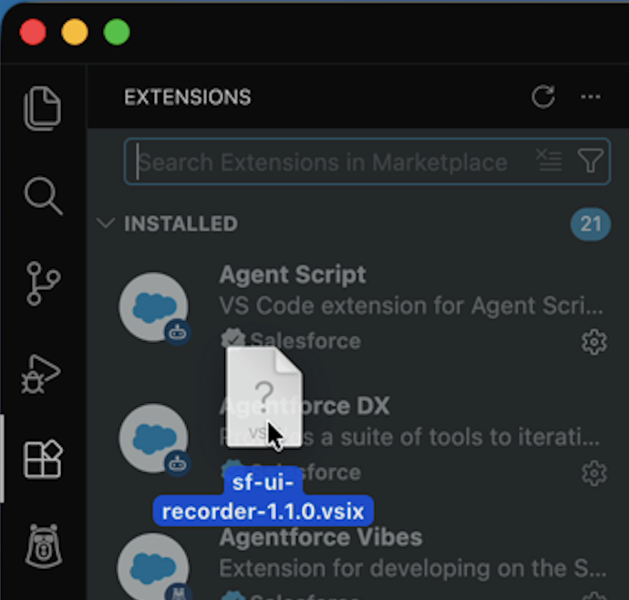

4. The extension will install automatically. You'll see a **"Completed installing extension."** notification at the bottom of the editor.

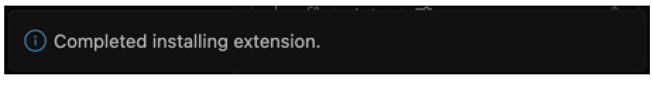

## Method 2: Install via Command Palette

If drag and drop isn't working, you can install from the Command Palette:

1. Open the Command Palette (`Ctrl+Shift+P` / `Cmd+Shift+P`).
2. Type **"install"** and select **"Extensions: Install from VSIX..."**.

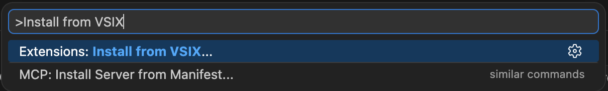

3. Browse to and select the `.vsix` file in the file picker dialog.

4. The extension installs and you'll see the **"Completed installing extension."** confirmation.


## Verify Installation

After installation, confirm the extension is active:

1. Open the Activity Bar on the left side of VS Code — you should see a new **Salesforce UI Script Recorder** icon (cloud with a record dot).
2. Click the icon to open the sidebar panel, which shows three sections: **Recordings**, **User Files**, and **Data Files**.
3. Alternatively, open the Command Palette (`Ctrl+Shift+P` / `Cmd+Shift+P`) and type **"SF UI Recorder"** to see the extension's commands.

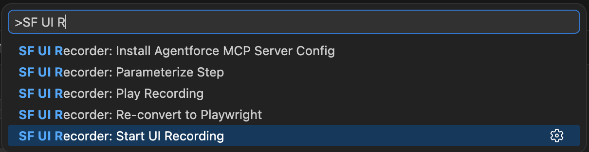

---

# Sidebar Panel

The extension adds a dedicated sidebar panel to VS Code for managing recordings, credentials, and test data.

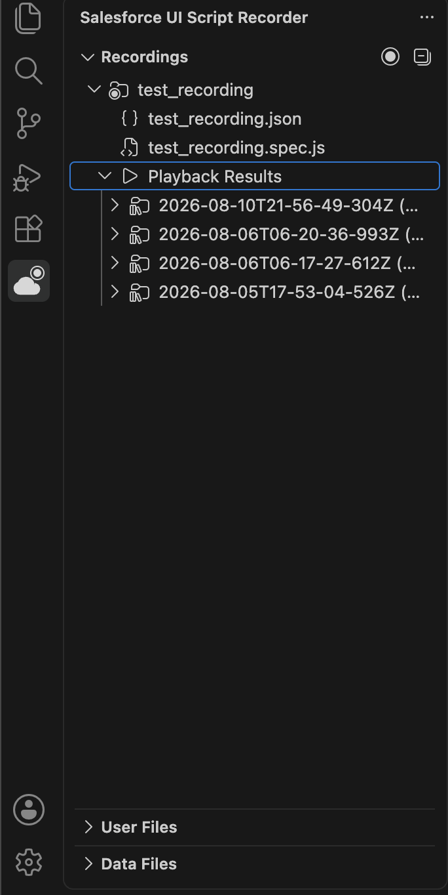

## Recordings Section

The **Recordings** section shows all recorded UI tests from the `test-plans/playwright/` directory.

- **Start a recording** — Click the **+** button in the header or the "Start UI Recording" welcome button when the list is empty.
- **Collapse all** — Click the collapse all icon in the header to collapse all expanded recordings at once.
- **Play a recording** — Click the **▶ Play** button on any recording to open the playback modal.
- **View history** — Click the **🕒 History** button (visible only if playback results exist) to view past test runs.
- **Expand/collapse** — Each recording expands to show the `.json` and `.spec.js` files, plus a "Playback Results" group if any runs have completed.
- **Rename** — Right-click a recording and select **Rename Recording**. Enter a new name, and after confirmation, the extension renames all associated files (`.json`, `.spec.js`) and playback result folders. A confirmation dialog shows exactly how many files and folders will be renamed.
- **Delete** — Right-click a recording and select **Delete Recording** to remove all associated files and results. (Note: The delete button has been removed from the inline actions for safety — use the right-click menu instead.)

## User Files Section

The **User Files** section lists CSV files from the `user-files/` directory, which contain username/password credentials for bulk playback runs.

- Click the **ℹ️ Info** icon in the header to learn what user files are for.
- Click the **📁 View in Explorer** icon to reveal the `user-files/` folder in VS Code's file explorer.
- Click any file to open it for editing.

This section is collapsed by default.

## Data Files Section

The **Data Files** section lists CSV files from the `data-files/` directory, which contain custom parameter values (e.g., account names, phone numbers) for bulk playback runs.

- Click the **ℹ️ Info** icon in the header to learn what data files are for.
- Click the **📁 View in Explorer** icon to reveal the `data-files/` folder in VS Code's file explorer.
- Click any file to open it for editing.

This section is collapsed by default.

---

# Using the Extension

## Core Features

### Record a Test

Record browser interactions and automatically generate a Playwright test script.

1. Click the **+** button in the Recordings section of the sidebar, or open the Command Palette (`Ctrl+Shift+P` / `Cmd+Shift+P`) and run **"SF UI Recorder: Start UI Recording"**.
2. Enter the URL you want to record against (e.g., your Salesforce org login page). Leave empty to default to `https://login.salesforce.com`. The extension auto-prepends `https://` if no protocol is provided.
3. **If multiple saved accounts exist for this URL**, a picker appears asking which account's authentication state to load. Select an existing account to skip device verification, or choose "New session" to start fresh.
4. A browser window will launch with an overlay control bar at the top of the page.

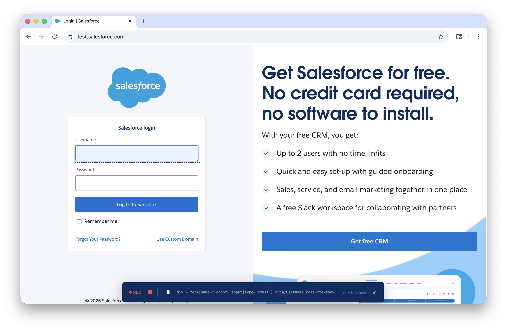

5. Interact with the page as you normally would — clicks, form fills, navigation, and keyboard actions are all captured.

6. When finished, click 🟥 **Stop** in the overlay (or press Cancel in the VS Code progress notification).

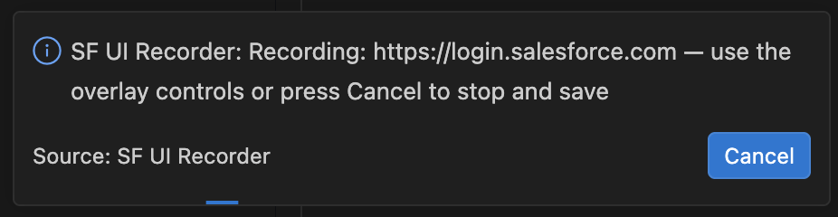

7. The extension saves your recording and automatically generates a Playwright test file. Your authenticated session (device cookies) is saved to `auth-states/<hostname>---<username>.json` for future use.

Your files are saved in a `test-plans/playwright/` folder in your workspace:

- `recording_<timestamp>.json` — the raw recording data
- `recording_<timestamp>.spec.js` — the generated Playwright test

The new recording appears immediately in the sidebar's Recordings section.

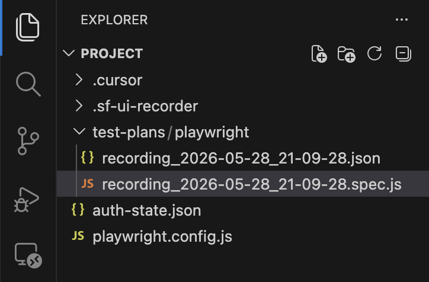

#### Overlay Controls

The in-browser overlay bar provides these controls:

| Control | Description |
|---------|-------------|
| 🔴 **REC** indicator | Red dot showing recording is active |
| 🟥 **Stop** | Red square — finish recording and generate output files |
| ⏸️ **Pause / ▶️ Resume** | Temporarily stop/resume capturing events without ending the session |
| **Selector display** | Shows the CSS selector of the element currently under your cursor |
| x **Hide** | Hide the overlay bar (press `Alt+K` to toggle it back) |

You can also close the browser window to stop recording — the output files will still be saved.


---

### Play Back a Test (Single Run)

Run a previously recorded test in the browser with a single set of credentials and parameters.

1. Click the **▶ Play** button on a recording in the sidebar, or open a `.spec.js` file and click the **Play** icon (▶) in the editor title bar.
2. The **Playback modal** opens showing a unified interface with two modes: **Single Run** and **Bulk / Parallel**.
3. **Recording selector** — Use the dropdown at the top to switch between different recordings without closing the modal.
4. **Headed/Headless toggle** — The toggle shows "Headed (show browser)" when enabled and "Headless (hidden browser)" when disabled. The label updates dynamically as you toggle.
5. In **Single Run** mode, fill in any required credential fields (username, password) and custom parameter fields.
6. Click **Run** to execute the test via Playwright in the integrated terminal.

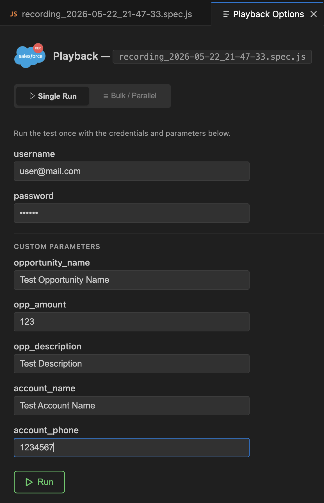

#### Playback Modal Features (Single Run)

- **Recording selector** — Dropdown in the header to switch between recordings. The modal updates in-place without flickering.
- **Mode toggle** — Switch between "▶ Single Run" and "☰ Bulk / Parallel" using the tab-style toggle at the top.
- **Headed/Headless toggle** — Shows the current browser mode ("Headed (show browser)" or "Headless (hidden browser)"). Updates dynamically.
- **Credential fields** — Username and password fields are displayed at the top. Password field is masked for security.
- **Custom parameter fields** — Any additional parameterized values (e.g., account name, phone number) appear below under a "Custom Parameters" heading.
- **Session caching** — Values are cached for the current VS Code session so you only need to enter them once.
- **Run button** — Disabled until all required fields are filled. Shows a green play icon.
- **Spec file badge** — Clickable badge in the header that opens the spec file in the editor.
- **History badge** — Clickable badge (visible only if results exist) that opens the results viewer.

> **Note:** On first playback, the extension may prompt you to create a supporting config file (`config/config.js`). Accept the prompt to generate it automatically.

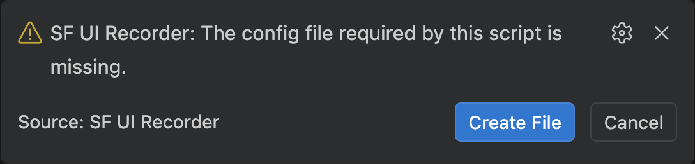

---

### Play Back a Test (Bulk / Parallel Run)

Run multiple test sessions in parallel, each with different credentials and data from CSV files.

1. Open a `.spec.js` file and trigger **"SF UI Recorder: Play Recording"**.
2. In the Playback modal, click **"☰ Bulk / Parallel"** to switch modes.
3. Select a **User credentials file** from the dropdown (CSV files from the `user-files/` directory).
4. Select one or more **Custom parameter data files** from the chip-based multi-select (CSV files from the `data-files/` directory).
5. Set the number of **Sessions** (parallel runs, 1–100).
6. Click **Run** — the extension spawns one terminal per session, cycling through CSV rows if there are more sessions than data rows.

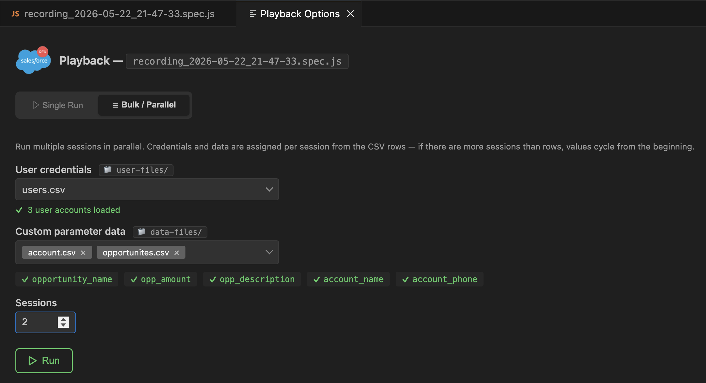

#### Bulk Run Features

- **User credential file dropdown** — Select a CSV from `user-files/`. Shows user count after selection (e.g., "3 user accounts loaded").
- **Create CSV wizard** — Click "+ Create CSV" at the bottom of the dropdown to generate a skeleton `users.csv` with username/password columns. You can name the file and it opens alongside for editing.
- **Data file multi-select** — Chip-based interface where each selected file appears as a removable chip. Click "+ Create CSV" to generate a new data file with columns matching your test's parameterized values.
- **Parameter coverage indicators** — Shows which parameters are covered by selected data files (green ✓ = covered, red ✗ = uncovered).
- **Column overlap warnings** — If multiple data files define the same column, a warning shows which file takes precedence (last file wins).
- **Cycle warnings** — If the number of sessions exceeds available CSV rows, a yellow warning explains that data will cycle from the beginning.
- **Folder badges** — Clickable `📁 user-files/` and `📁 data-files/` badges that reveal the folder in the VS Code explorer.
- **File links in warnings** — Clickable file names in warning messages that open the CSV file for editing (with "Edit CSV" tooltip on hover).
- **Sessions field** — Set the number of parallel terminals to spawn (1–100). Validates input with inline error messages.

#### CSV File Format

**User credentials** (`user-files/*.csv`):

```csv
username,password
user1@myorg.com,pass123
user2@myorg.com,pass456
```

**Custom parameter data** (`data-files/*.csv`):

```csv
account_name,phone,email
Acme Corp,555-1234,acme@example.com
Globex Inc,555-5678,globex@example.com
```

---

### Providing Values for Parameterized Steps

The generated test uses parameterized values for inputs like username and password. **Username and Password fields are automatically parameterized** during recording — you'll be prompted to provide their values before each playback run.

When you click **Play Recording**, the Playback modal appears with input fields for every parameterized value in the test. Fill in the values and press **Run** — the extension passes them as environment variables to Playwright automatically.

- Values are **cached for the session** — you only need to enter them once per VS Code window.
- The password field is masked for security.
- The Run button is disabled until all required fields are filled.

> **Note:** If you run tests directly from the terminal (outside the extension), you'll need to set the environment variables manually. They follow the format `SF_UI_RECORDER_<PARAM_NAME>` (uppercased):
>
> ```bash
> # macOS / Linux
> export SF_UI_RECORDER_USERNAME="user@mail.com"
> export SF_UI_RECORDER_PASSWORD="yourpassword"
>
> # Windows (PowerShell)
> $env:SF_UI_RECORDER_USERNAME = "user@mail.com"
> $env:SF_UI_RECORDER_PASSWORD = "yourpassword"
>
> # Windows (Command Prompt)
> set SF_UI_RECORDER_USERNAME=user@mail.com
> set SF_UI_RECORDER_PASSWORD=yourpassword
> ```

---

### View Playback Results

After running a test, results are saved to the `playback-results/` directory and appear in the sidebar under each recording.

1. In the sidebar's Recordings section, expand a recording that has been played back at least once.
2. You'll see a **"Playback Results"** group showing timestamped folders for each run.
3. Click the **🕒 History** button on the recording, or click a specific result folder to view:
   - Test output and screenshots
   - Pass/fail status for each step
   - Execution timeline
   - HTML export option for shareable reports

**Result folder naming:**

- Single runs: `<recording-name>---<timestamp>`
- Bulk runs: `<recording-name>---<timestamp>---BULK/` with `session-1/`, `session-2/`, etc. subdirectories

You can right-click a result folder and select **"View result files"** to jump to that folder in the sidebar's expanded tree view.

---

## Utility Features

> **Important:** Parameterizing a step will automatically regenerate your `.spec.js` file, **overwriting** any manual edits. If you need to customize a test beyond what parameterization offers, do so *after* you are finished parameterizing all steps.

### Parameterize a Step

Replace a recorded value with a dynamic variable — useful for making tests reusable across environments or with different data each run.

1. Open a recording `.spec.js` file in the editor.
2. Look for the **CodeLens** action above each input step (e.g., `+Parameterize "Opportunity Name"`).

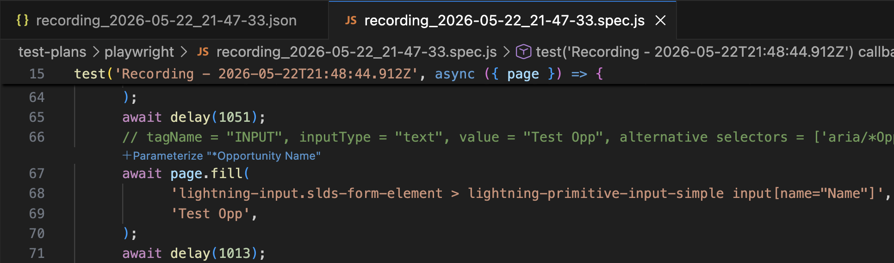

3. Click the CodeLens link and select an option:
  - **Config Variable** — the value is read from an environment variable (`SF_UI_RECORDER_<NAME>`) at runtime. You'll be prompted to name the parameter.
  - **Remove Parameterization** — reverts the step back to its original recorded value.

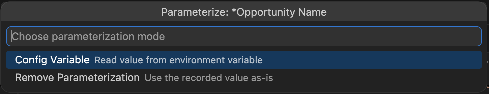

4. After parameterizing, the `.spec.js` file is automatically regenerated.

> **Note:** Parameterization CodeLens buttons are only shown in the `.spec.js` file, not the `.json` file. Username and password fields are automatically parameterized during recording.

#### Gutter Decorations

Parameterized steps are marked with a teal icon in the editor gutter (in the `.spec.js` file) and highlighted in the overview ruler, making it easy to scan which steps are dynamic at a glance.

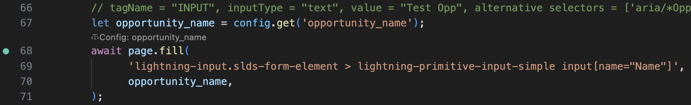

---

### Re-convert to Playwright

Regenerate the `.spec.js` test file from the recording JSON. Useful after manually editing the JSON or after parameterizing steps.

1. Open a recording `.json` file.
2. Click the **"$(refresh) Re-convert to Playwright"** CodeLens link at the top of the file.
3. A warning modal appears explaining that reconversion will overwrite any manual changes to the `.spec.js` file. Click **"Proceed"** to continue or **"Cancel"** to abort.
4. The corresponding `.spec.js` is regenerated and opened in the editor.

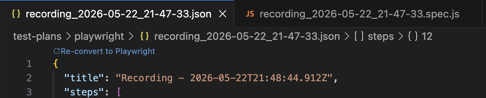

> **Warning:** Re-converting will overwrite your `.spec.js` file. Any manual edits you've made to the generated script will be lost. Always parameterize steps via the JSON file *before* making manual customizations to the spec file.

---

### Install Agentforce Vibes MCP Server Config

Set up the Model Context Protocol (MCP) integration for use with Agentforce AI tooling.

1. Open the Command Palette and run **"SF UI Recorder: Install Agentforce MCP Server Config"**.
2. The extension writes the MCP server configuration to the appropriate platform-specific location:
  - **macOS:** `~/Library/Application Support/Code/User/globalStorage/salesforce.salesforcedx-einstein-gpt/settings/a4d_mcp_settings.json`
  - **Windows:** `%APPDATA%/Code/User/globalStorage/salesforce.salesforcedx-einstein-gpt/settings/a4d_mcp_settings.json`
  - **Linux:** `~/.config/Code/User/globalStorage/salesforce.salesforcedx-einstein-gpt/settings/a4d_mcp_settings.json`
3. A notification confirms success with an option to open the config file.

---

## Multi-Account Session Persistence (Skipping MFA)

For Salesforce orgs with MFA, the extension automatically persists authenticated sessions for multiple accounts so that:

1. You only log in once per account across multiple recording sessions
2. Playwright test playback skips authentication entirely
3. You can switch between accounts without re-authenticating

### How It Works

When you finish a recording session, the extension automatically saves device identity cookies (like `sfdc_lv2`) to `auth-states/<hostname>---<username>.json` in your workspace. The `playwright.config.js` (auto-generated if missing) loads the appropriate auth state during playback based on the username parameter, restoring the browser's device trust without requiring login.

**Multi-account support:**

- Each Salesforce account gets its own auth state file, identified by hostname and username (e.g., `auth-states/login.salesforce.com---user@example.com.json`).
- When starting a recording, if multiple accounts exist for the target URL, a picker appears asking which account to use.
- During playback, the extension automatically selects the correct auth state based on the username you provide in the playback form.

The auth state is continuously updated after each successful recording, so the cookie stays fresh. If the session expires (typically 2–12 hours for Salesforce orgs), simply start a new recording and log in again — the auth state will refresh automatically.

### Workflow

```bash
# First recording for user1@example.com — log in manually (including MFA)
# auth-states/login.salesforce.com---user1@example.com.json is saved automatically

# Recording for user2@example.com — prompted to pick existing or start new
# auth-states/login.salesforce.com---user2@example.com.json is saved automatically

# Subsequent recordings — picker shows both accounts, select to skip verification
# Selected auth state is loaded and refreshed

# Playback — correct auth state is loaded based on username parameter
npx playwright test --headed
```

---

# Using with Agentforce Vibes

If you prefer a conversational workflow, you can control SF UI Recorder through natural language prompts in Agentforce Vibes. After installing the MCP server config (see above), the following capabilities are available:

## Record

Start a recording session by asking Agentforce to record. A browser window will launch and you interact with it just like a manual recording.

**Example prompts:**

- "Start a recording at [https://myorg.salesforce.com](https://myorg.salesforce.com)"

## Playback

Run a previously recorded test by asking Agentforce to play it back.

**Example prompts:**

- "Run the most recent recording"
- "Play back recording_2025-05-15.spec.js in headed mode"

## Convert

Regenerate a Playwright test script from a recording JSON file.

**Example prompts:**

- "Convert my latest recording to a test script"
- "Re-convert recording_2025-05-15.json"

## List Recordings

See all available recordings in your workspace.

**Example prompts:**

- "What recordings do I have?"
- "List all my recorded tests"

> **Note:** The MCP integration communicates with the VS Code extension via a file-based trigger mechanism (`.sf-ui-recorder/trigger.json`). Your editor must be open with the SF UI Recorder extension active for Agentforce Vibes commands to work.

---

# Known Limitations

- **Hover interactions are not captured.** UI elements that only appear on hover (e.g., tooltips, dropdown menus triggered by mouseover) will not be recorded. Tests that depend on these elements will fail during playback. Hover event support is not yet available.
- **MFA requires manual verification on first recording per account.** During your first recording session for a given account, you will need to manually complete the MFA challenge. On subsequent recordings and playbacks with that account, MFA should be bypassed automatically — the extension saves device identity cookies in `auth-states/<hostname>---<username>.json` for reuse. The auth state is continuously updated after each successful login, so the cookie should stay fresh. If issues arise, you may need to manually enter the MFA code again during recording and/or playback.
- **One-time UI elements will cause playback failures.** If you interact with transient elements during recording — such as popovers, toast notifications, or first-time-use prompts — those steps will likely fail on playback since the elements won't be present on subsequent runs. For now, you will need to manually remove those steps from the recording JSON. Automatic detection and filtering of one-time elements is planned for a future release.
- **Salesforce sessions expire.** Auth state typically lasts 2–12 hours. When the session expires, re-run the recorder and log in again to refresh the stored state.
- **Chromium only.** Recording uses Chrome DevTools Protocol (CDP) isolated world injection and only works with Chromium-based browsers.